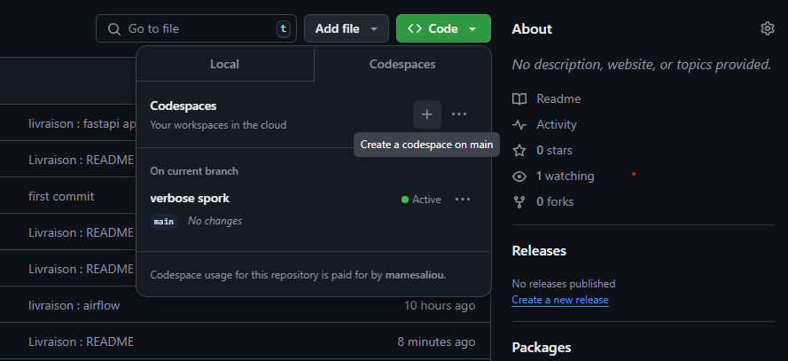

# Spotify Data Engineering Pipeline

## Contexte et Objectif

Ce projet vise à construire un pipeline de traitement complet pour l'historique d'écoute Spotify, allant de l'ingestion des données brutes à leur exposition via une API, en passant par le nettoyage, l'enrichissement et le stockage dans une base NoSQL.

### Technologies Utilisées

- **Python**: Pour l'extraction, la transformation et le nettoyage des données.
- **Pandas & Apache Spark**: Pour la manipulation et la transformation des données.
- **MongoDB**: Pour le stockage des données nettoyées.
- **FastAPI**: Pour l'exposition des données via une API REST.
- **Apache Airflow**: Pour l'automatisation et l'orchestration du pipeline.

## Description du Dataset

Le fichier `SpotifyHistory.csv` contient 149 860 enregistrements et 11 colonnes :

- `spotify_track_uri`: Identifiant unique du morceau sur Spotify.
- `ts`: Timestamp de lecture (YYYY-MM-DD HH:MM:SS).
- `platform`: Plateforme d’écoute (web player, android, ios).
- `ms_played`: Durée d’écoute en millisecondes.
- `track_name`: Nom du morceau joué.
- `artist_name`: Nom de l’artiste.
- `album_name`: Nom de l’album associé au morceau.
- `reason_start`: Raison du démarrage de la lecture.
- `reason_end`: Raison de l’arrêt du morceau.
- `shuffle`: Mode aléatoire (True ou False).
- `skipped`: Morceau sauté (True ou False).

## Pipeline de Traitement

### 1. Extraction des données

Lisez le fichier CSV et chargez les données dans un DataFrame.

### 2. Transformation et Nettoyage des Données

Appliquez les règles suivantes :
- Remplacement des valeurs manquantes.
- Conversion des types.
- Création de nouvelles colonnes (`minutes_played`, `day_of_week`, `hour_of_day`).
- Nettoyage des chaînes de caractères.
- Suppression des doublons.
- Filtrage des écoutes de moins de 5 secondes.

### 3. Chargement dans MongoDB

Insérez les données transformées dans une base MongoDB (base de données : `spotify_history`, collection : `history`).

### 4. Exposition via une API FastAPI

Créez une API REST permettant :
- CRUD : Ajout, mise à jour, suppression, consultation des écoutes.
- Statistiques : Top artistes, titres, albums, taux de morceaux sautés, répartition par jour/heure.

### 5. Automatisation avec Apache Airflow

Définissez un DAG Airflow pour orchestrer le pipeline et exécuter automatiquement les étapes.

## Structure du Projet

```markdown
📁 data/
  - spotify_history.csv: Fichier contenant les données sources.

📁 scripts/
  - extract.py: Extraction des données depuis le CSV.
  - transform.py: Nettoyage et enrichissement des données.
  - load.py: Insertion des données dans MongoDB.

📁 fastapi_app/
  - main.py: Code de l’API FastAPI avec les endpoints CRUD et statistiques.

📁 dags/
  - spotify_pipeline_dag.py: Définition du DAG Airflow pour orchestrer le pipeline.

📄 requirements.txt: Liste des dépendances Python nécessaires au projet.

### 6. Installation et Exécution (Github codespaces (Recommended))

Create Github codespaces :



python -m venv venv
source venv/bin/activate

pip install -r requirements.txt

Installing MongoDB :
Import the public key used by the package management system:
wget -qO - https://www.mongodb.org/static/pgp/server-4.4.asc | sudo apt-key add -
Create a list file for MongoDB:
echo "deb [ arch=amd64,arm64 ] https://repo.mongodb.org/apt/ubuntu focal/mongodb-org/4.4 multiverse" | sudo tee /etc/apt/sources.list.d/mongodb-org-4.4.list
Reload local package database:
sudo apt-get update
Install the MongoDB packages:
sudo apt-get install -y mongodb-org
Create the Data Directory:
sudo mkdir -p /data/db
sudo chown -R `id -u` /data/db
Start MongoDB:
mongod --dbpath /data/db
Verify MongoDB is Running:
mongo

uvicorn fastapi_app.main:app --reload

[core]
# The folder where your airflow pipelines live, most likely a
# subfolder in a code repository. This path must be absolute.
#
# Variable: AIRFLOW__CORE__DAGS_FOLDER
#
#dags_folder = /home/codespace/airflow/dags
dags_folder = /workspaces/tp_data_python_mongo_api_2/dags/

[webserver]
enable_proxy_fix = True

airflow standalone
